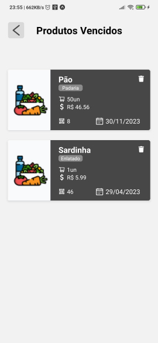

# View Food

####  Trabalho de Graduação do curso de Análise e Desenvolvimento de Sistemas da [Fatec Itu](https://fatecitu.edu.br/portal/cursos/analise-e-desenvolvimento-de-sistemas/)

* Aplicativo para praticidade e agilidade no controle e gerenciamento da validade de produtos alimentícios.
* Aplicativo React-Native/Expo. 
* [View Food Backend](https://github.com/Grazielle127/viewfood-backend) NodeJS API REST para requisições ao banco ao MongoDB.

## :camera: Screenshots
 
 
 

## :signal_strength: Tecnologias

* [Expo v49](https://docs.expo.io/) - Framework e plataforma para aplicações React, instalada globalmente;
* [React Native 0.71.4](https://reactnative.dev/) para criar o aplicativos nativos para Android e iOS;
* [React Native Web 0.18.11](https://www.npmjs.com/package/react-native-web) - Componentes e APIs para Web;
* [Styled Components](https://styled-components.com/docs) para construção de componentes a partir do CSS.

## :floppy_disk: Setup

* Execute `npm i -g expo-cli` para instalar o Expo CLI globalmente
* Rode `npm i` ou `yarn` para instalar as dependências
* Rode `expo start` para iniciar a aplicação expo localmente

## :books: Informações Gerais
- React [useState hook](https://reactjs.org/docs/hooks-state.html) utilizado para controlar os dados dos usuários e dos produtos.
- React [useEffect hook](https://reactjs.org/docs/hooks-effect.html) utilizado para carregar as telas com as informações dos produtos.

## :point_right: Integrantes
* [Grazielle Nascimento Ferreira](https://github.com/GrazielleNascimento)
* [Paulo Henrique Vieira Mujollo](https://github.com/PauloMujollo)